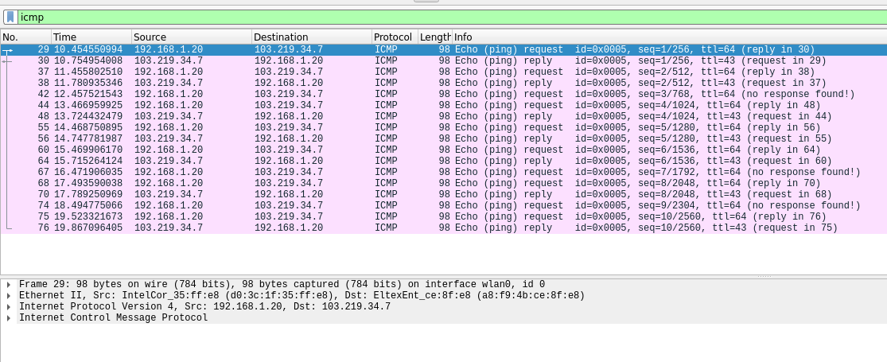
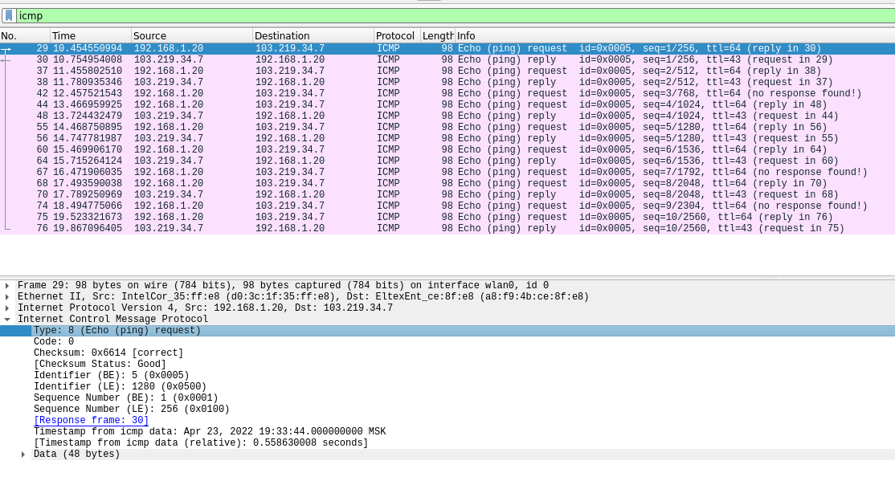
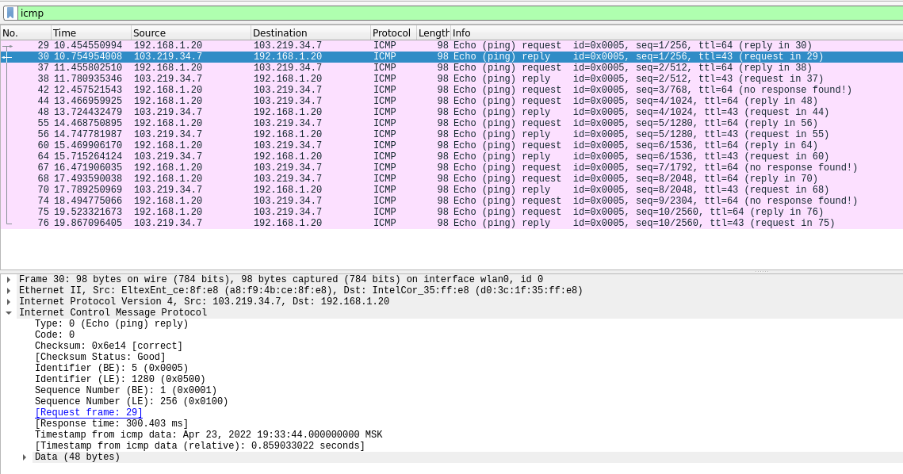
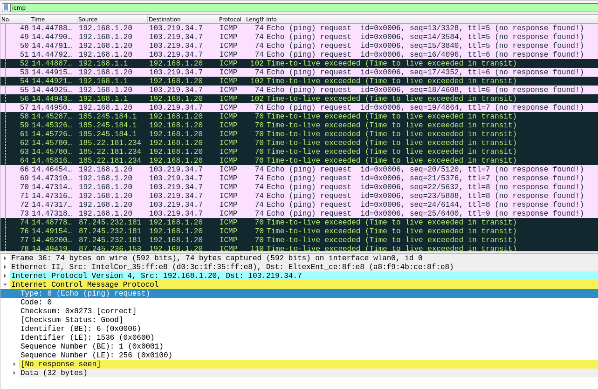
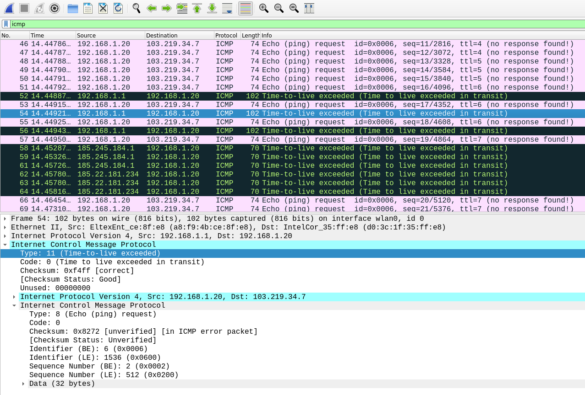
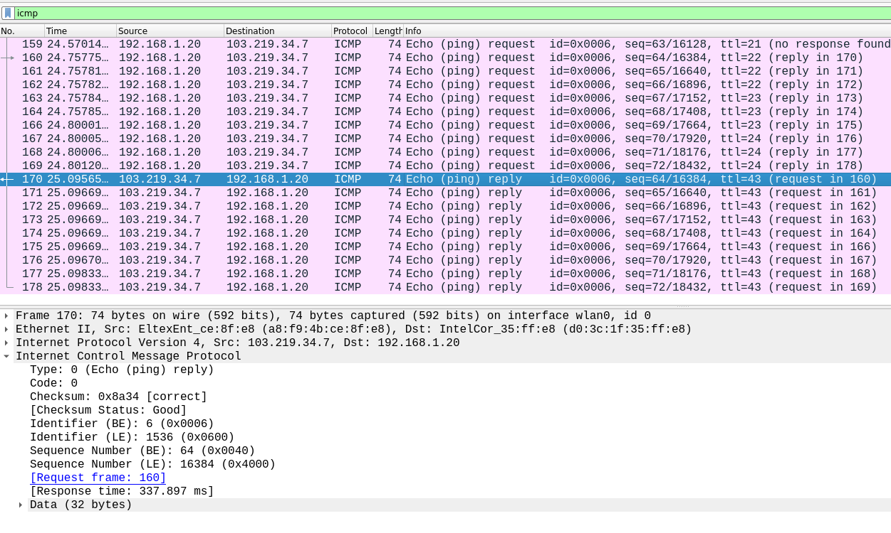

# Wireshark
## 1. Ping
Ping запрос по адресу `durgod.com`.

1. IP-адрес хоста: `192.168.1.20`, IP-адрес хоста назначения `103.219.34.7`.
2. Номеров пакетов нет ICMP-пакет находится на сетевом уровне, а не на транспортном, где они и нужны.
3. Первый запрос моего хоста

  - Type: 8 (Echo (ping) request)
  - Code: 0
  - Другие поля: Checksum, Identifier (BE), Identifier (LE), Sequence Number (BE), Sequence Number (LE), Timestamp from icmp data
  - Каждый имеет вид `0xXXXX`, поэтому два байта
4. Ответ на первый запрос

  - Type: 0 (Echo (ping) reply)
  - Code: 0
  - Другие поля: Checksum, Identifier (BE), Identifier (LE), Sequence Number (BE), Sequence Number (LE), Timestamp from icmp data
  - Аналогично 2 байта

## 2. Traceroute
1. Да, отличается:
  - Размер данных 32 байта вместо 48
  - Другой набор ttl: было 64, стало от 1 до 43
  - Нет полей Timestamp from icmp data
  

2. Отличия ответа
  - Исходный эхо-запрос входит как новое поле
  - Новое поле Internet Protocol Version 4
  

3. У меня это не только три последних, а больше
  - Эти пакеты отмечены успешными, у них Type: 0 (Echo (ping) reply)
  - ttl стал 43
  - Нет полей IPv4 и копии исходного

4. Ощутимая задержка происходит после пятого запроса. 
`87.245.236.153` находится в Лондоне, а `202.97.95.205` уже где-то в Китае, из имен можно понять только, что один будет в Китае, про второй только с помощью внешних ресурсов.

