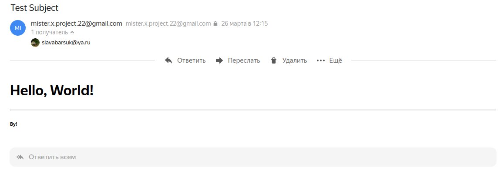
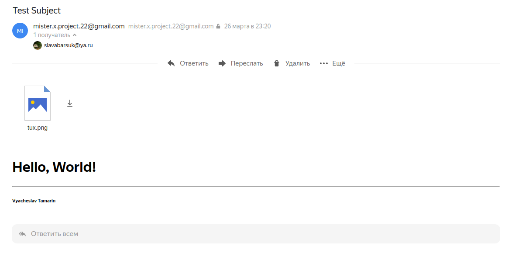

# SMTP, транспортный уровень

### Конфигурация

В качестве smtp-сервера используется `smtp.gmail.com`.

Адрес отправителя и ключ задаются в файле `src/config.py`.

### Запуск

* Отправка письма с содержимым в файле `main-content-file` (первая строка - тема) на адрес `email`.
```
pipenv run python src/mail_samples.py -c <mail-content-file> -r '<email>'
```
- Получить дополнительную справку:
```
pipenv run python src/mail_samples.py --help
```

* Отправка письма с содержимым в файле `main-content-file` (первая строка - тема) на адрес `email`. Опционально можно указать список файлов после ключа `-f`.
```
pipenv run python src/email_sender.py -c <mail-content-file> -r '<email>' -f '<file1>' '<file2>' ...
```

- Получить дополнительную справку:
```
pipenv run python src/email_sender.py --help
```

### Скриншоты

1. Отправка письма с использованием библиотеки `smtplib`:
```
pipenv run python src/mail_samples.py -c mail.txt -r slavabarsuk@ya.ru
```


2. Отправка письма на сокетах с изображением:
```
pipenv run python src/mail_samples.py -c mail.txt -r slavabarsuk@ya.ru -f tux.png
```



### Зависимости
* `loguru` для логов
